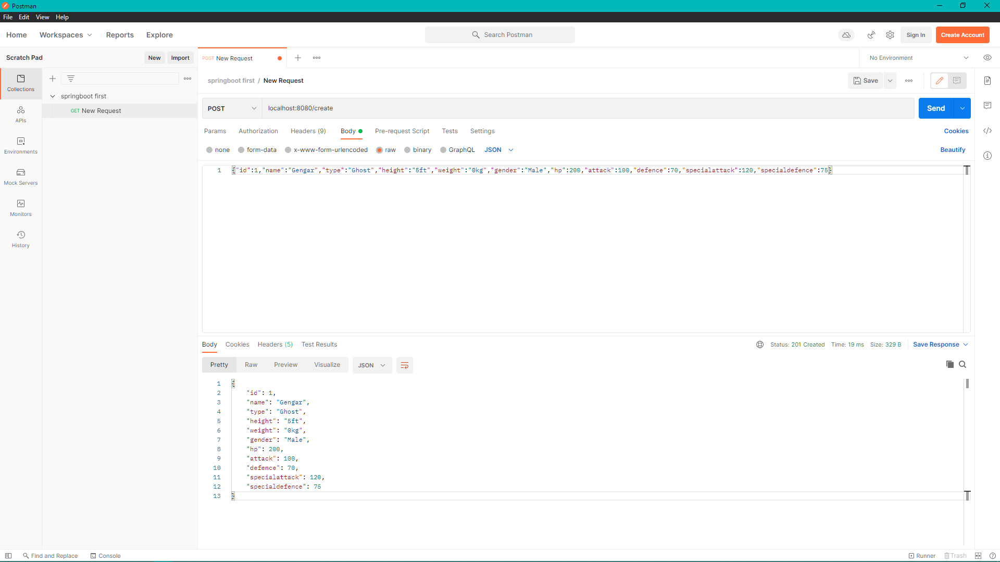
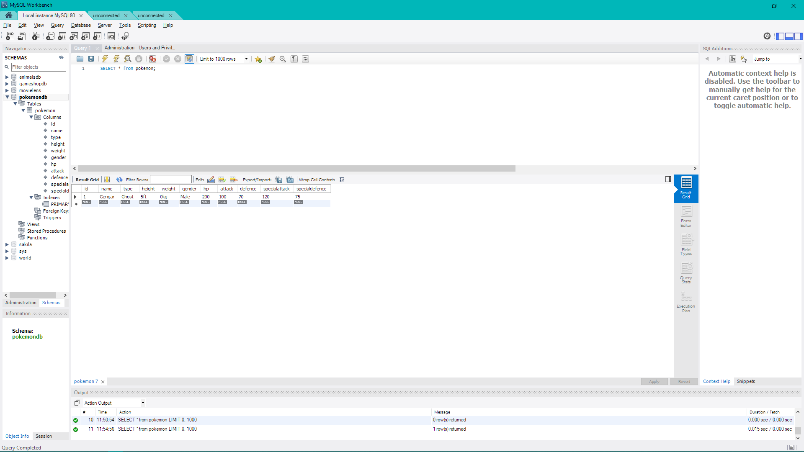
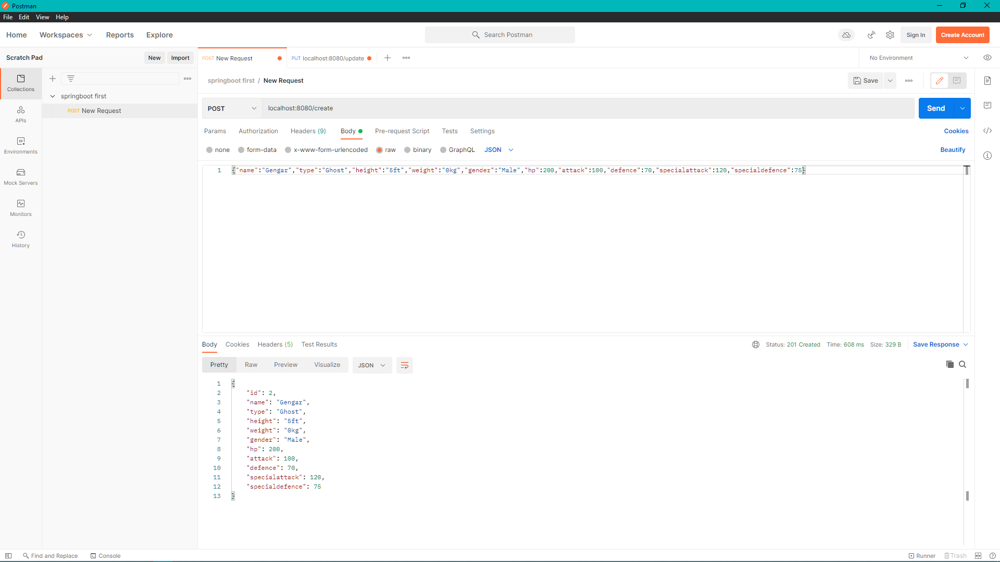
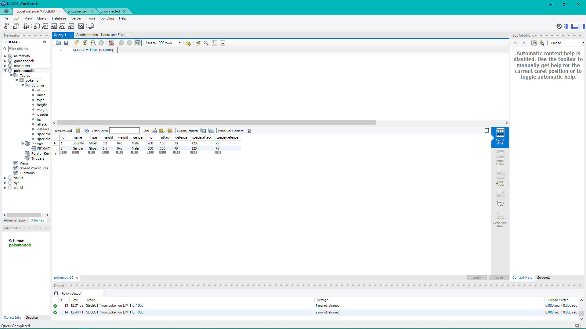
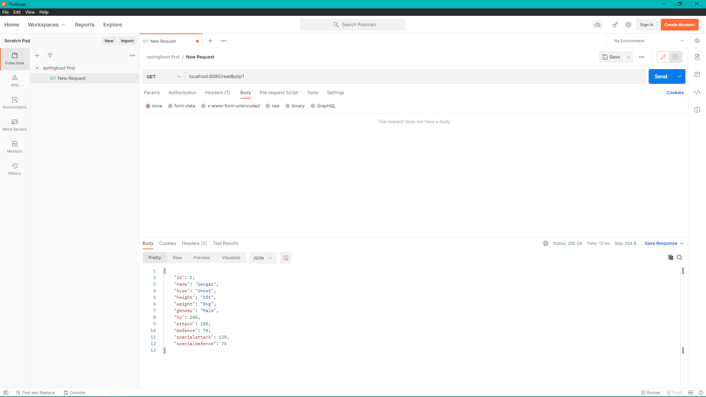
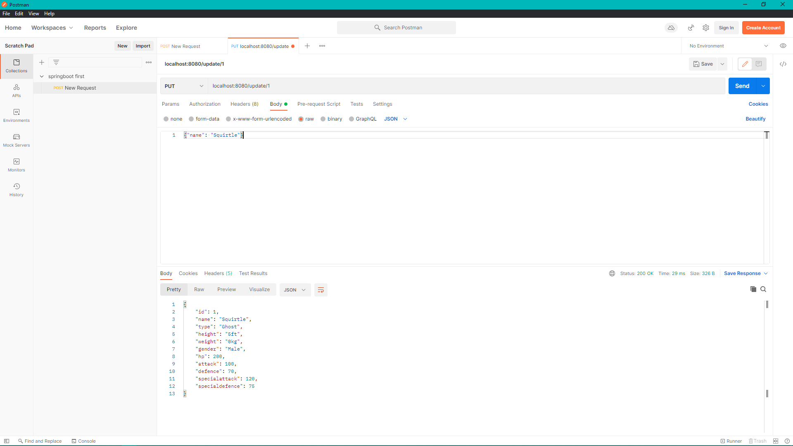
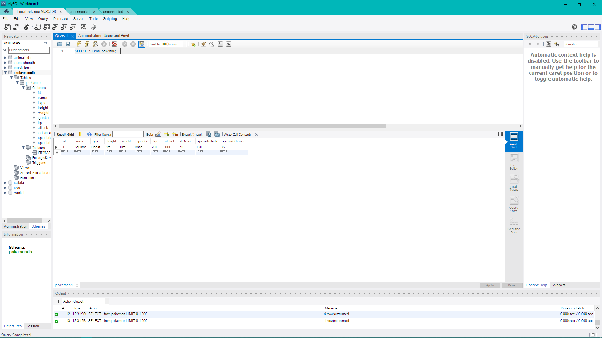
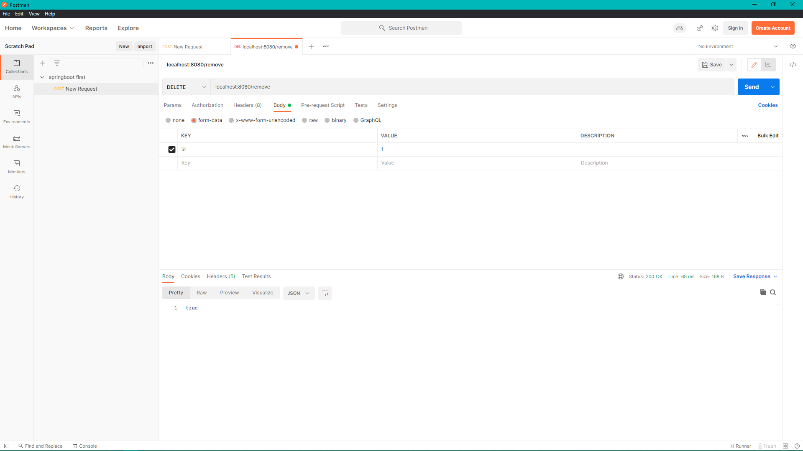
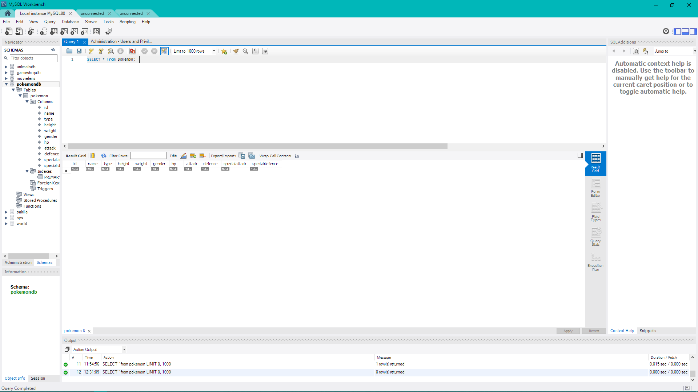

# Pokemon API

## Why are we doing this?
For my final project as part of the DFESW12 bootcamp I was tasked to create a basic REST API using java and the other tools I have learnt in the past 9 weeks such as SpringBoot, Maven and Junit. 
I was also asked to plan this specific build using Agile with MoSCoW priority methods which you can find here: [Jira Board](https://danijohnson.atlassian.net/jira/software/projects/QA/boards/2)
## How I expected the challenge to go.
I was nervous to begin this task as the last 9 weeks have gone by so fast and there's been a lot going on outside of the course as well and I was uncertain if I had retained all the knowledge bestowed onto me, 
however with the help of my tutor and peers I was able to finish and present a working API.

## What went well? / What didn't go as planned?
During the project I found it to be relatively easy to complete with a few hiccups here and there to missed syntax until I started testing, implementing the tests I found particularly challenging and faced a number of errors of which were a majority of missing syntax and confused logic,
however I overcame this by seeking external sources for information and some advice from my fellow coursemates and managed to complete 11 tests of my code with 87.8% coverage which is more than the industry standard of 80%.

## Possible improvements for future revisions of the project.
To improve on this particular project if I was to do it again, I would create a front end. Creating a front end would allow for a more user friendly interface for people to use rather than just those who are comfortable using the command line.
I would also streamline more of my code and make it more effecient, potentially using new methods such as lombok which unfortunately we didn't get time to cover and I didn't have the time to look into externally.

## Screenshots showing your postman requests and the output from the API.

### Create

### ReadAll

### ReadOne

### Update

### Delete

## Screenshots of your database to prove that data is being persisted.

## Screenshot of your test results, including coverage report.

